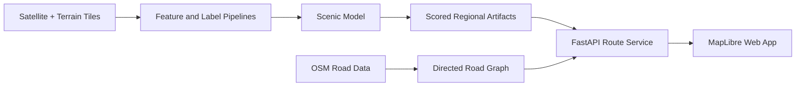

# Scenic Drive

Scenic Drive finds routes that trade a small amount of travel time for better scenery. It combines satellite imagery, terrain signals, learned scenic scores, and a directed road graph behind a FastAPI service and a lightweight MapLibre web app.

The current product surface is the **New England North** web app. It compares the fastest route with a scenic alternative, renders regional scenic scores, and exposes the active model result.

## What is here

- **Route comparison** — fastest and scenic routes with distance, duration, and scenic-score deltas.
- **Learned scenic scoring** — satellite embeddings, terrain features, classifier signals, and mixed human/heuristic labels.
- **Regional web app** — a static MapLibre client with no frontend build step.
- **Reproducible operations** — locked Python dependencies, artifact manifests, container definitions, and focused CI checks.



## Quick start

### Requirements

- Python 3.11+
- [`uv`](https://docs.astral.sh/uv/)
- A Mapbox access token for map tiles and address search
- Node.js 20+ only for the viewer test

Install the locked development environment:

```bash
uv sync --frozen --extra dev
```

Start the API:

```bash
export MAPBOX_ACCESS_TOKEN=<your-token>
uv run uvicorn src.app_api.main:app --host 0.0.0.0 --port 8080 --reload
```

In another terminal, serve the static app:

```bash
cd apps/new_england_north
python3 -m http.server 3000
```

Open <http://localhost:3000>. Useful API endpoints:

- Health: <http://localhost:8080/v1/healthz>
- Interactive API reference: <http://localhost:8080/scalar>

A clean checkout can run the API and app shell. Heatmaps and route comparison require the ignored graph, report, registry, and model artifacts described in the [deployment guide](docs/setup/deployment.md).

## Hosted beta

The beta uses Nginx for the static app and reverse proxy, plus FastAPI for the API. Runtime artifacts and credentials are mounted or supplied externally; they are never copied into image layers.

```bash
cp .env.beta.example .env.beta
# Set MAPBOX_ACCESS_TOKEN in .env.beta

docker compose --env-file .env.beta -f compose.beta.yml up --build
```

Open `http://localhost:${SCENIC_WEB_PORT:-80}`. Before deployment, bootstrap and validate the canonical artifacts using the [deployment runbook](docs/setup/deployment.md).

## Repository layout

```text
apps/new_england_north/  Static MapLibre web app
src/app_api/             FastAPI application and contributor endpoints
src/route_planner/       Graph, cost, planning, cancellation, and service logic
src/classifier/          Landscape classifier training and inference
src/scenic_scorer/       Learned scenic regression
src/terrain/             Terrain-RGB feature extraction
src/heuristics/          Labeling and report generation
src/data_pipeline/       Tile and S3 data access
scripts/                 Grouped workflow CLIs
notebooks/               Interactive marimo workflows
config/                  Region and storage configuration
deploy/                  Versioned beta artifact manifests
docs/                    Architecture, setup, research, and roadmap
archive/                 Curated historical material
```

## Common workflows

| Goal | Entry point |
|---|---|
| Download regional tiles | `scripts/ingest/download_bbox_tiles.py` |
| Annotate scenic labels | `notebooks/annotate_scenic.mo.py` or `scripts/annotation/annotate_scenic_web.py` |
| Plan, score, select, and annotate an active-learning batch | `scripts/ingest/plan_active_learning_region.py`, `scripts/modeling/score_active_learning_pool.py`, and `scripts/annotation/select_active_learning.py` |
| Train and evaluate scoring | `notebooks/regression.mo.py` and `scripts/modeling/` |
| Generate regional reports | `scripts/reports/heuristic_report.py` |
| Build an OSM road graph | `scripts/routing/build_graph_from_osm.py` |
| Compare routes | `scripts/routing/route_compare_service.py` |
| Run remote training | `scripts/remote/` and the [Vast.ai runbook](docs/setup/vast-training.md) |

Run a marimo workflow with, for example:

```bash
uv run marimo edit notebooks/regression.mo.py
```

Stage-One active-learning runs are isolated under
`data/processed/active_learning/<run_name>/`. Plan before acquisition, then
score, select, annotate, and finalize the same run:
```bash

uv run python scripts/ingest/plan_active_learning_region.py --run-name <run_name>
uv run python scripts/ingest/plan_active_learning_region.py --run-name <run_name> --acquire --workers 8
uv run python scripts/modeling/score_active_learning_pool.py --manifest data/processed/active_learning/<run_name>/tile_manifest.csv --run-name <run_name>
uv run python scripts/annotation/select_active_learning.py --candidate-input data/processed/active_learning/<run_name>/candidate_pool.csv --prior-annotations data/raw/labels_human.csv --run-name <run_name>
uv run python scripts/annotation/annotate_scenic_web.py --batch-csv data/processed/active_learning/<run_name>/annotation_batch.csv --annotations-csv data/raw/labels_human.csv
uv run python scripts/modeling/build_mixed_labels.py --heuristic-labels data/processed/active_learning/<run_name>/candidate_pool.csv --annotations-csv data/raw/labels_human.csv --output data/processed/active_learning/<run_name>/mixed_labels.csv
uv run python scripts/annotation/build_human_benchmark.py --annotations-csv data/raw/labels_human.csv --geographic-splits-csv data/processed/active_learning/<run_name>/geographic_splits.csv --output-dir data/processed/active_learning --run-name <run_name>
uv run python scripts/annotation/finalize_stage1.py --run-root data/processed/active_learning/<run_name> --run-name <run_name>
```

Train one bounded deterministic Stage-Two candidate from an admitted handoff:

```bash
uv run python scripts/modeling/train_active_scenic.py \
  --handoff data/processed/active_learning/<run_name>/stage1_handoff.json \
  --output-dir data/processed/active_learning/<run_name>/training \
  --epochs 20 --batch-size 64 --max-steps 200 --max-seconds 1800 --device auto
```

The guarded autoresearch launcher is opt-in. It validates the Stage-One handoff,
active baseline, human benchmarks, route QA, and bounded experiment ladder
before starting work:

```bash
OMP_RUN_AUTORESEARCH=1 bash autoresearch.sh \
  --handoff data/processed/active_learning/<run_name>/stage1_handoff.json \
  --run-name <run_name> \
  --expanded-benchmark-csv data/processed/active_learning/<run_name>/expanded_human_benchmark.csv \
  --control-benchmark-csv data/processed/active_learning/<run_name>/control_benchmark.csv \
  --route-qa-json data/processed/active_learning/<run_name>/route_qa.json \
  --max-experiments 3 --max-steps 200 --max-seconds 1800 --device auto
```

Omit `OMP_RUN_AUTORESEARCH=1` to keep the launcher inert. Use `--dry-run` to
validate inputs and persist only the planned experiment ladder.


The finalizer fails closed unless acquisition, scoring, human annotation,
fixed geographic splits, human benchmark, mixed labels, artifact hashes, and
the active baseline identity all validate.

## Documentation

- [Architecture](docs/architecture/infrastructure.md) — current offline and online system boundaries
- [Data layout](data/README.md) — canonical local and S3 artifact paths
- [Deployment](docs/setup/deployment.md) — required beta artifacts, bootstrap, validation, and startup
- [AWS/S3 setup](docs/setup/aws-s3.md) — credentials, bucket layout, sync, and lifecycle policy
- [Remote training](docs/setup/vast-training.md) — container and Vast.ai lifecycle
- [Roadmap](docs/roadmap.md) — current product, model, data, and routing priorities
- [ML research log](docs/research/ml-research-log.md) — learned-score model history and promotion evidence
- [Routing performance log](docs/research/routing-performance-autoresearch.md) — benchmark results and retained experiments
- [Archive manifest](archive/archive.md) — historical, non-primary material

## Tests

```bash
uv run pytest -q
node --test tests/test_new_england_north_viewer.mjs
```

These are the same two gates run by GitHub Actions.

## Project boundaries

- Model weights, datasets, generated reports, road graphs, caches, and credentials stay outside Git.
- The responsive web app is canonical; the archived native app is not active.
- Remote training is operator-run, not a hosted training service.
- The repository is a private source preview, not a self-contained data or model release.

## License

Private repository — not for distribution. All rights reserved; see [LICENSE](LICENSE).
