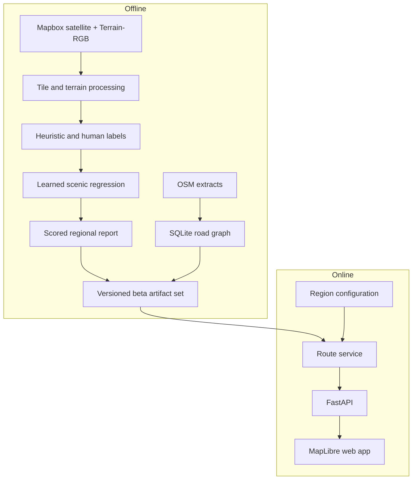

# Architecture

Scenic Drive separates expensive regional preparation from latency-sensitive route requests. The offline pipeline produces versioned artifacts; the online service loads those artifacts and serves the static New England North app.

## System overview

## Offline pipeline

1. `scripts/ingest/` downloads or synchronizes satellite and Terrain-RGB tiles.
2. `src/terrain/` and `src/heuristics/` derive tile features and weak scenic labels.
3. `scripts/annotation/` and `notebooks/annotate_scenic.mo.py` collect and reconcile human labels.
4. `scripts/modeling/` and the marimo modeling notebooks export features, train regression candidates, evaluate them, and promote one checkpoint into the model registry.
5. `scripts/reports/` writes learned regional score artifacts.
6. `scripts/routing/build_graph_from_osm.py` converts OSM extracts into the directed regional SQLite graph.

Large inputs and outputs live under ignored `data/`, `models/`, and `cache/` paths or in S3. See the [data contract](../../data/README.md).

## Online request path

The static app in `apps/new_england_north/` calls `src/app_api/main.py`. FastAPI resolves the selected region from `config/app_regions.json` and delegates route work to `src/route_planner/`.

The route planner provides:

- directed graph loading and adjacency storage;
- nearest-edge projection and request-local endpoint overlays;
- fastest-path and duration-bounded scenic search;
- highway preference handling;
- cancellation, deadlines, and disposable worker supervision;
- route geometry and metric serialization.

At beta startup, required-preload mode validates and opens the configured graph, report, registry, checkpoint, and persisted spatial edge index. A missing or inconsistent artifact prevents startup.

## Runtime boundaries

| Surface | Responsibility |
|---|---|
| `apps/new_england_north/` | MapLibre UI, search controls, heatmap, route comparison |
| `src/app_api/` | HTTP schemas, region/artifact resolution, contributor endpoints |
| `src/route_planner/` | Graph representation, endpoint projection, route objectives, execution safety |
| `config/app_regions.json` | Region bounds and active artifact paths |
| `deploy/beta_artifacts.json` | Versioned release artifact identity, sizes, and digests |
| `compose.beta.yml` | Nginx/API topology and read-only runtime mounts |

## Artifact contract

The hosted beta treats the following as one versioned set:

- regional SQLite road graph and persisted edge-index sidecar;
- learned report and route overlay;
- model registry and active checkpoint;
- region configuration;
- deployment manifest and checksums.

The JSON deployment manifest is authoritative. `scripts/deploy/bootstrap_beta_artifacts.py` fetches and verifies the set, while `scripts/routing/check_beta_artifacts.py` validates cross-artifact semantics. See the [deployment runbook](../setup/deployment.md).

## Deployment topology

`compose.beta.yml` runs two services:

- **web** — Nginx serves the static app and proxies `/api`;
- **api** — FastAPI reads processed data and models from read-only mounts.

Credentials are runtime-only. Image builds contain source and dependencies, never datasets, model weights, generated reports, graphs, or tokens.

## Design constraints

- Preserve deterministic route and tie behavior across storage or search optimizations.
- Keep immutable graph bases reusable; isolate request-local endpoint and score overlays.
- Propagate one absolute deadline through loading, projection, planning, and worker supervision.
- Promote models and artifact sets explicitly; never infer an active checkpoint from filenames.
- Profile the production-sized graph before retaining routing optimizations.

Detailed model evidence lives in the [ML research log](../research/ml-research-log.md); routing benchmark evidence lives in the [routing performance log](../research/routing-performance-autoresearch.md).
