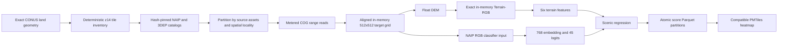

# Proposed Nationwide Streaming Scenic-Score Map

## Status

**Research proposal — not implemented, cost-validated, or approved for nationwide execution.**

This document defines a potential workflow for producing a complete contiguous-United-States (CONUS) z14 scenic-score surface without retaining a nationwide satellite or Terrain-RGB image archive. It is the design input for the implementation prompt in [`notes/04-nationwide-streaming-score-map.md`](../../notes/04-nationwide-streaming-score-map.md).

The central hypothesis is that Scenic Drive can remain below a **$100 one-time execution ceiling** by reading only required COG byte ranges, processing bounded batches in memory, and retaining compact scores and provenance. That hypothesis is not evidence. A metered 10,000-tile benchmark must establish the real request amplification, transferred bytes, preprocessing throughput, inference throughput, and output size before a national run is authorized.

## Decision boundary

The proposed workflow is eligible for CONUS execution only when all of these are observed:

1. the exact CONUS z14 land-tile count and coverage report;
2. byte- and score-parity evidence against the canonical persistent NAIP/3DEP pipeline;
3. human-grounded evidence that the active model remains valid on the streamed NAIP/3DEP distribution;
4. a geographically stratified 10,000-tile benchmark projecting total cost at or below **$75**, leaving contingency below a hard **$100** ceiling;
5. complete request, byte, compute, storage, retry, and failure accounting;
6. deterministic crash/resume and artifact-union evidence;
7. regional, scene, distribution, and supported-route QA.

Failure of any gate rejects or redesigns the nationwide run. It does not justify weakening the gate.

## Scope

### Included

- CONUS land coverage on the repository's exact Web Mercator XYZ z14 grid;
- paired NAIP RGB and USGS 3DEP elevation inputs;
- the active classifier and regression feature contract;
- in-memory creation of the exact canonical Terrain-RGB representation;
- atomic, partitioned score output with source/model/preprocessing provenance;
- an optional PMTiles heatmap derived from compatible score partitions;
- bounded pilots, explicit authorization requests, and fail-closed resource controls.

### Excluded

- Alaska, which does not have complete NAIP coverage under the current source contract;
- any claim of literal 50-state coverage without selecting and validating an alternate Alaska imagery source;
- permanent nationwide satellite or terrain PNG storage;
- a monolithic nationwide feature NPZ;
- model promotion based only on successful inference;
- calling classifier entropy or raw model output a calibrated confidence value;
- national route QA where no compatible national road graph exists.

Hawaii and territories may be studied separately only with explicit geometry, imagery, terrain, and model-validation contracts. They are not silently included in CONUS evidence.

## Why this differs from the canonical workflow

The committed NAIP/3DEP workflow in `scripts/ingest/naip_3dep_workflow.py` is designed for deterministic acquisition and reproducible retained raster pairs. Its source contract, `config/data_sources/naip_3dep_v1.json`, currently declares:

- an explicit `allowed_states` list limited to the current eastern/Midwestern target region, mirrored by `src.data_pipeline.naip.ALLOWED_STATES`;
- whole-object source downloads;
- deterministic 512×512 satellite PNG output;
- deterministic 512×512 Terrain-RGB PNG output;
- content-addressed source caching;
- a 370,000-coordinate planning limit;
- inventory and scoring paths built around retained files.

Those choices are appropriate for bounded datasets and reproducibility, but they make dense nationwide materialization expensive. The streaming proposal preserves the same source, grid, preprocessing, model, and identity semantics while changing the execution and retention contract:

| Concern | Canonical retained-raster workflow | Proposed nationwide workflow |
|---|---|---|
| Source access | Whole objects, local source cache | Explicit metered COG ranges, bounded block cache |
| Tile preprocessing | Arrays then persistent PNG pairs | Arrays and Terrain-RGB exist only in memory |
| Scoring input | Manifest paths to retained images | Bounded in-memory satellite/terrain batches |
| Feature retention | Candidate CSV and full feature NPZ | Score rows; optional sampled diagnostics only |
| Resume unit | Acquired tile pair | Hash-bound Parquet partition |
| Final product | Source-versioned raster corpus | Score partitions and compatible PMTiles |
| Nationwide suitability | Storage and transfer dominated | Potentially compute dominated; must be benchmarked |

The retained-raster path remains the parity oracle for bounded tests. It must not remain a second production-scale nationwide implementation after the streaming cutover is accepted.

## Proposed end-to-end flow



### 1. Exact national tile inventory

Reuse the geometry and coordinate primitives rather than creating new Web Mercator math:

- `src.data_pipeline.region_planning.enumerate_land_tiles`
- `src.data_pipeline.region_planning.enumerate_polygon_tiles`
- `src.data_pipeline.web_mercator.tile_bounds_wgs84`
- `src.data_pipeline.web_mercator.tile_transform_web_mercator`

The inventory must be generated from a hash-pinned official CONUS land geometry and contain one deterministic row per admitted tile. The exact count is unknown until this run executes. Preliminary estimates are not planning truth.

Required inventory fields include `z`, `x`, `y`, jurisdiction, land fraction, geometry identity, and deterministic partition key. The planner records excluded water, boundary limitations, state counts, and duplicate/leakage checks. It performs no imagery or terrain access.

The current `max_coordinates=370000` limit must not simply be deleted. A separate versioned nationwide contract may raise it only after the exact inventory, storage bounds, and partition plan are known.

### 2. Catalog and provider contract

Every run consumes immutable normalized catalogs. Durable identities use canonical provider/item/object identifiers, never expiring signed query strings.

Candidate imagery access paths:

1. **AWS `naip-visualization`**
   - canonical durable S3 object keys;
   - Requester Pays in `us-west-2`;
   - JPEG-compressed RGB COGs with internal overviews;
   - request and transfer pricing must be refreshed and pinned before authorization.
2. **Microsoft Planetary Computer NAIP**
   - public STAC collection and Azure-hosted COGs;
   - canonical STAC item and asset identities can be durable while operational SAS URLs remain ephemeral;
   - bulk rate limits, terms, range behavior, egress, and recommended compute region must be measured rather than assumed.

USGS 3DEP remains mandatory for terrain unless a replacement passes the same vertical datum, resolution, no-data, coverage, and parity contracts.

Provider selection is an experimental outcome. The implementation must benchmark eligible access paths on the same tile sample and retain the simplest provider that satisfies identity, coverage, throughput, and cost gates. Silent provider fallback is prohibited.

### 3. Metered COG range access

Reuse and extend:

- `src.data_pipeline.metered_transport.MeteredTransport`
- `Boto3MeteredTransport`
- `NetworkCaps`
- `SharedMeteredBudget`
- `MeteredLedger`

The current transport can meter explicit `get_range` operations. The missing production interface is a COG window reader that maps a target window to explicit, identity-checked byte ranges and a bounded decoded block cache.

A remote raster library is acceptable only if its hidden LIST, HEAD, GET, retry, and byte behavior is either routed through the metered transport or reconciled completely against an authoritative provider ledger. A library that bypasses accounting cannot be the canonical execution path.

Workers should process tiles in source-asset/spatial order so adjacent target tiles reuse TIFF headers, overviews, and compressed blocks. Cache keys include canonical object identity, version/ETag/checksum, byte range, and decoder contract. Cache size is fixed and bounded; cache contents are expendable and are not a durable source corpus.

### 4. Aligned in-memory preprocessing

Reuse the canonical target and preprocessing semantics from:

- `src.data_pipeline.raster_processing.process_imagery`
- `src.data_pipeline.raster_processing.process_dem`
- `src.data_pipeline.web_mercator.TargetGrid`
- `config/data_sources/naip_3dep_v1.json`

The missing interface accepts opened windows/datasets or arrays rather than local paths. Both sources are warped to the exact same EPSG:3857 z14 512×512 grid, pixel centers, transform, bounds, and orientation.

The terrain path is mandatory:

```text
3DEP source ranges
  -> float elevation in declared vertical datum
  -> land no-data and coverage validation
  -> deterministic float DEM reprojection
  -> exact Terrain-RGB uint8 array in memory, transposed from encoder CHW to feature API HWC
  -> canonical terrain feature extraction
  -> release DEM and Terrain-RGB arrays
```

Terrain-RGB encoding remains byte-exact. For finite elevation `h` in meters:

```text
q = floor((h + 10000.0) * 10.0 + 0.5)
require 0 <= q <= 16777215
R = (q >> 16) & 255
G = (q >> 8) & 255
B = q & 255
```

Decoded round-trip error must remain at most `0.0500001 m`. NaN/Inf or no-data on valid land fails the tile. Ocean fill occurs only after applying the pinned land mask.

`src.terrain.features.compute_terrain_features` accepts RGB arrays, so no PNG serialization is required. The six regression features remain, in canonical order:

1. normalized slope variation;
2. elevation change divided by 1000;
3. water proximity;
4. vegetation density;
5. coastal indicator;
6. lake-or-river indicator.

### 5. Bounded model inference

The active model contract is unchanged:

```text
satellite RGB
  -> ViT-B/16 classifier at 224x224
  -> 768-dimensional embedding
  -> 45 RESISC45 class logits

Terrain-RGB + satellite RGB
  -> six terrain features

768 + 6 + 45
  -> ScenicRegressionModel
  -> scenic score in [0, 10]
```

Reuse model loading and identity validation from `src.active_learning.scoring.load_scoring_models` and `src.scenic_scorer.regression.ScenicRegressionModel`.

The existing `score_tile_manifest` is not the nationwide executor because it materializes result structures and feature arrays for the complete pool. The new public batch primitive should accept bounded in-memory RGB arrays, return bounded score/QC rows, and release tensors after each batch. Batch size, prefetch depth, CPU worker count, GPU queue depth, and peak resident memory are explicit run parameters and evidence fields.

The output may record normalized class entropy as `class_uncertainty`. It must not relabel `1 - entropy`, regression output, or any other value as calibrated scenic confidence without a separately validated calibration artifact.

### 6. Score-only artifact contract

The canonical output is a directory of atomic Parquet partitions plus a run manifest. A reasonable row contract is:

| Field | Type | Meaning |
|---|---|---|
| `z` | `uint8` | Always 14 for this contract |
| `x`, `y` | `uint32` | Exact XYZ coordinate |
| `jurisdiction_id` | dictionary integer | Pinned geometry assignment |
| `scenic_score` | `float32`, nullable | Model score for successful rows |
| `class_uncertainty` | `float32`, nullable | Normalized classifier entropy, not confidence |
| six terrain feature fields | `float32`/boolean | Exact regression terrain vector |
| `water_fraction` | `float32`, nullable | Satellite water diagnostic |
| `terrain_sea_level_fraction` | `float32`, nullable | Terrain diagnostic |
| `status` | dictionary enum | Scored, unusable, missing, or failed |
| `error_code` | dictionary enum, nullable | Failure reason; null for successful rows |
| `source_asset_set_id` | dictionary integer, nullable | Reference into immutable source table; null when no source set exists |
| `acquisition_identity_sha256` | fixed 32-byte value | Source/grid/preprocessing identity |

Run-level values such as source contract SHA-256, catalogs, geometry, preprocessing identity, classifier checkpoint, regression checkpoint, calibration identity, code/source-tree digest, commands, seeds, and rate card belong in the partition manifest rather than being repeated as long strings in every row.

Each partition is staged, schema-validated, row-count and coordinate-range checked, hashed, fsynced where applicable, and atomically installed. The manifest records its SHA-256, coordinate digest, counts, min/max score, failure summary, and metered ledger interval.

Full embeddings and class logits are not retained by default. A bounded, deterministic diagnostic sample may retain them for parity and source-shift analysis. Any future feature sidecar is a separately budgeted artifact, not an implicit part of the national score map.

### 7. Crash-safe partitioning and resume

The execution plan assigns every coordinate exactly once to deterministic partitions, preferably grouped by source assets and spatial locality while preserving a canonical coordinate digest.

A partition is complete only when:

- its output exists;
- its schema and row count match the immutable plan;
- its coordinate digest matches;
- its SHA-256 matches the checkpoint record;
- its source/model/preprocessing/run identities match;
- its ledger reservation and settlement reconcile.

Resume skips only partitions that pass all checks. Corrupt run-owned partitions are quarantined before replacement. Foreign or unowned outputs fail closed. Pending work is rebuilt from validated completed partitions, never inherited from a stale `completed_coordinates` field.

Parallel workers use leases or atomic claims. The main run owns one global budget, catalog identities, and final union. Workers cannot expand caps or substitute sources.

### 8. Compatible PMTiles export

A PMTiles heatmap is derived only after all score partitions validate. The exporter rejects mismatched source, catalog, geometry, grid, preprocessing, model, calibration, score schema, or code identities. Duplicate coordinates must be absent or score/identity identical under an explicit duplicate policy.

The PMTiles representation may encode z14 score polygons or a compatible lower-zoom visualization pyramid. It is a visualization artifact, not promotion evidence. Exact output size, browser performance, and hosting cost are benchmark outputs.

## Cost model and authorization

No static table can currently prove a national price. The 10,000-tile benchmark must measure each term:

```text
network request cost
  = settled billable requests * pinned per-request rate

network transfer cost
  = settled billable bytes * pinned transfer rate

compute cost
  = instance wall time * pinned instance price

storage cost
  = temporary and durable byte-hours * pinned storage rate

artifact upload cost
  = requests + transfer + retained storage

total projected national cost
  = exact planned partitions * observed stratified cost distribution
    + catalog/discovery fixed cost
    + PMTiles/export cost
    + declared contingency
```

The projection must include p50 and conservative p95/p99 behavior across source vintage, COG layout, terrain, coast, nodata, and retry slices. Mean bytes per tile alone is insufficient.

`NetworkCaps` controls requests, transfer, local bytes, and Requester-Pays spend. It does not by itself cap compute or durable storage. The orchestrator must additionally bind:

- maximum instance price;
- maximum instance count;
- maximum wall-clock runtime;
- maximum temporary disk;
- maximum output bytes;
- maximum upload bytes;
- teardown on completion, cap, deadline, or terminal failure.

The promotion target is projected total cost `<= $75`. The authorized national execution must have a hard aggregate ceiling below `$100` across network, compute, storage, and artifact operations. Billing sources with insufficiently prompt or auditable accounting require conservative reservation, not optimistic after-the-fact alerts.

## Required experiment ladder

### Gate 0: offline contracts

- Exact CONUS tile inventory and geometry hashes.
- Catalog schemas and durable source identities.
- Static authorization package with no network call.
- Unit and fixture tests for range mapping, alignment, Terrain-RGB, schema, budget math, and resume.

### Gate 1: 500-tile persistent-versus-streaming parity

Select a fixed geographically and technically diverse sample. Run each tile through both the retained-raster oracle and streaming path using identical source objects.

Require:

- identical selected source assets and target grids;
- byte-identical satellite RGB and Terrain-RGB arrays where the same deterministic decoder path permits it;
- identical QC decisions;
- identical terrain feature vectors or a predeclared floating tolerance justified by observed arithmetic;
- score equivalence within a predeclared numeric tolerance;
- zero unmetered network operations;
- no persistent streaming PNG outputs.

### Gate 2: human-grounded source-shift validation

Use `scripts/annotation/build_source_shift_batch.py` and `scripts/modeling/evaluate_source_shift.py` with a fixed, geographically representative matched-source batch. Human annotations must cover validation/test evidence rather than only training labels.

Evaluate error, rank behavior, calibration, regional and scene slices, water/coast/nodata cases, score distribution, and supported route behavior. The active registry remains unchanged unless every existing compound promotion gate passes.

### Gate 3: 10,000-tile stratified cost and reliability benchmark

The sample must span jurisdictions, latitude, NAIP vintages/resolutions, COG organizations, 3DEP assets, urban/rural land, mountains/plains, coast/inland, and source-boundary mosaics.

Record:

- exact requests and bytes by operation/source;
- cache hit/miss and block amplification;
- decoder/reprojection/feature/inference timings;
- CPU/GPU utilization and peak memory;
- retries, throttling, failures, and provider limits;
- temporary and final artifact sizes;
- instance and storage prices;
- projected p50/p95/p99 national cost and runtime.

Pass only when the conservative complete projection is `<= $75`, all operations reconcile, and no unsupported provider assumption remains.

### Gate 4: crash/resume and union

Interrupt active workers at deterministic points, restart, and prove:

- no lost or duplicate coordinates;
- no repeated settled spend for completed partitions beyond explicitly recorded cache misses;
- invalid/foreign outputs are rejected;
- final union is invariant to worker completion order;
- manifests and PMTiles are byte-identical across equivalent reruns where the toolchain promises determinism.

### Gate 5: authorized CONUS execution

Only a separate explicit authorization may launch the national run. Execute fixed partitions under aggregate caps, publish complete ledgers and hashes, validate the PMTiles layer in the web client, run supported route QA, upload authorized durable artifacts, verify remote hashes, and tear down all compute immediately.

A completed inference process is not completion if human, distribution, route, cost, registry, or durability evidence is missing.

## Rejected alternatives

### Dense nationwide PNG cache

Rejected as the default national product because it duplicates public source pixels, creates millions of small files, increases transfer and storage, and is not required by the route product. Bounded raster samples remain useful for parity, annotation, and debugging.

### Satellite-only scoring

Rejected because the active regression contract requires six terrain features in addition to the satellite embedding and class logits. A satellite-only map is a different model and requires a separate training and promotion process.

### Direct float-DEM feature shortcut

Not accepted without parity evidence. The active feature path decodes canonical Terrain-RGB. The streaming workflow initially constructs the exact Terrain-RGB array in memory and uses `compute_terrain_features`; bypassing that representation is a future measured model/preprocessing change.

### Hidden unmetered GDAL network I/O

Rejected because successful COG reads do not prove request, byte, retry, or spend accounting. Any remote raster stack must meet the ledger contract.

### Monolithic nationwide NPZ

Rejected because it couples completion to one large object, retains model-specific features unnecessarily, weakens incremental resume, and can require large memory during construction and consumption.

### Automatic provider fallback

Rejected because a provider change alters byte content, vintages, access costs, and provenance. Fail and re-plan under a new source contract instead.

## Implementation surface

Expected reusable or modified areas:

- `src/data_pipeline/region_planning.py` — exact national land enumeration;
- `src/data_pipeline/web_mercator.py` — canonical tile grid;
- `src/data_pipeline/metered_transport.py` — explicit metered ranges and aggregate caps;
- `src/data_pipeline/naip.py` — deterministic imagery catalog and selection;
- `src/data_pipeline/usgs_3dep.py` — deterministic terrain catalog and selection;
- `src/data_pipeline/raster_processing.py` — dataset/window/array preprocessing interface;
- `src/data_pipeline/source_contracts.py` — streaming, partition, score, and report identities;
- `src/active_learning/scoring.py` — reusable bounded in-memory inference primitive;
- `scripts/ingest/naip_3dep_workflow.py` — planning/authorization integration or clean replacement by one canonical streaming orchestrator;
- `scripts/modeling/export_prediction_heatmap.py` — partitioned score input and PMTiles-compatible export;
- `scripts/annotation/build_source_shift_batch.py` — human benchmark preparation;
- `scripts/modeling/evaluate_source_shift.py` — source-shift gates;
- `src/route_planner/` and `src/app_api/` — only for supported post-map route and serving validation;
- `data/README.md`, architecture, setup, and deployment documentation — final artifact contracts after implementation.

Potential new modules must each own one clear concern: remote COG windows, streaming orchestration, or score-partition artifacts. Do not create duplicate coordinate, model-loading, budget, identity, or promotion frameworks.

## Research conclusion

A complete CONUS z14 **score surface** below `$100` is technically plausible because imagery and Terrain-RGB need not be retained. It is not yet demonstrated. The decisive next action is implementation of the metered streaming path followed by the 500-tile parity and 10,000-tile cost benchmarks. No national acquisition or production claim should precede those results.
