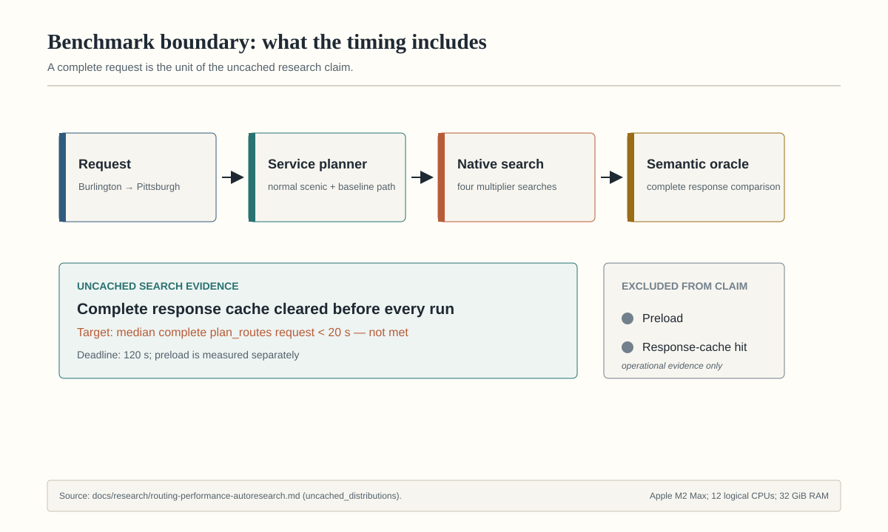
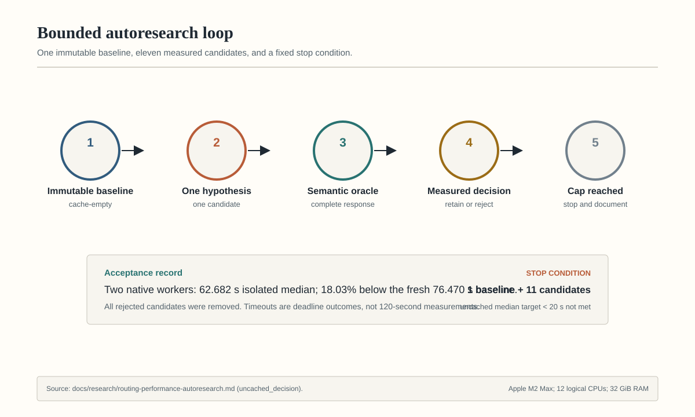
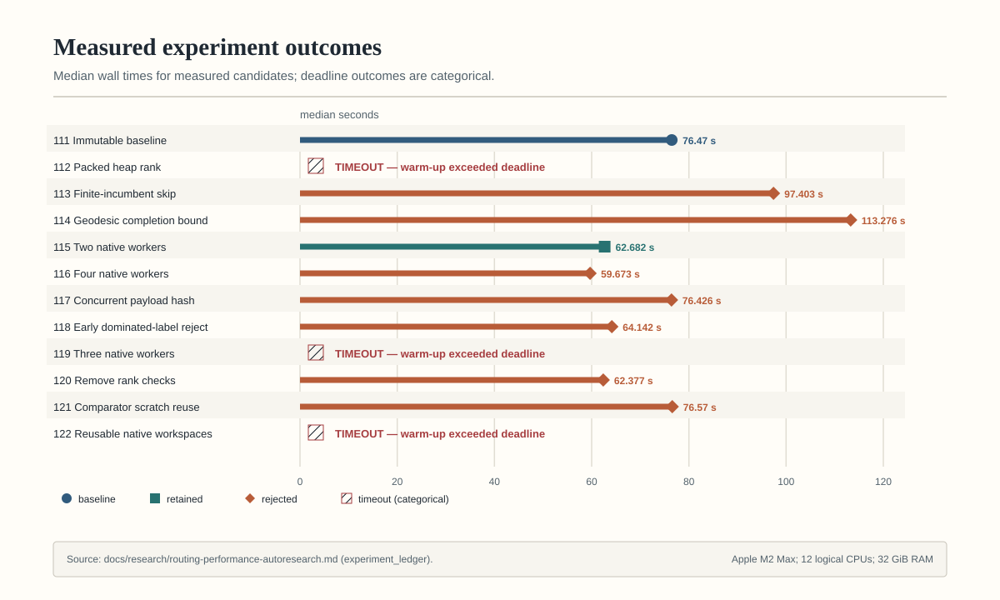
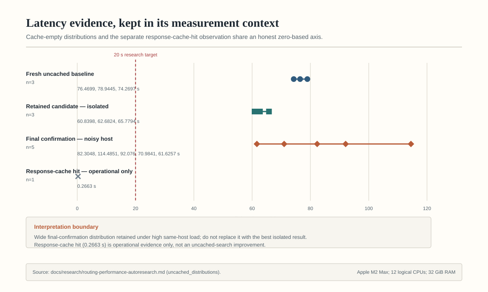
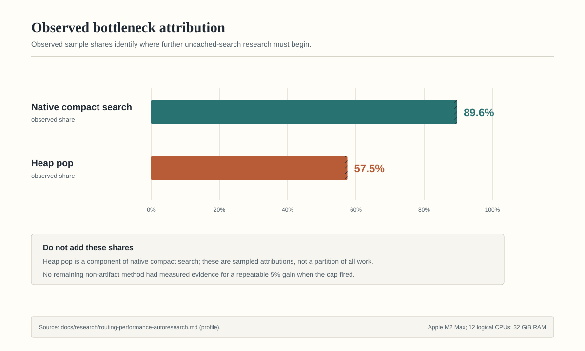
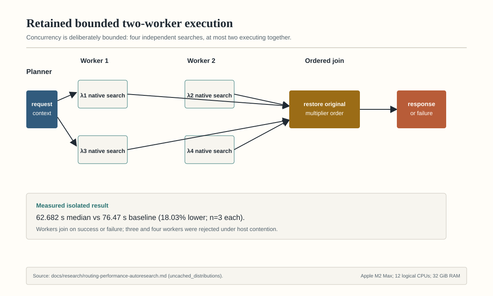

# Routing Performance Autoresearch Log

## Abstract and current conclusions

Scenic Drive's current routing-performance gate is a complete, **uncached**
Northeast Expanded `plan_routes` request. The 2026-08-12 bounded campaign did
not meet its target of a median below 20 seconds: its five-run confirmation
median was 82.3048 seconds. The retained two-worker Lagrangian implementation
did show an 18.03% lower isolated median than the fresh baseline, but its
confirmation distribution regressed 7.63% under high and variable host load.
That distinction is intentional: the implementation is retained; the
performance target is not claimed as met.

Repeated identical warm requests are a separate operational case. The bounded
response cache reduced their five-run median to 45.740 ms, but a cache miss
still executes the exact search and the last measured miss median was 80.937
seconds. Cache-hit latency is never evidence of faster uncached traversal.

The older 2,256-case New England North Vast study remains useful historical
evidence for the scalar incumbent bound: it reduced all-case median latency by
80.80% under the then-current route policy. Half of that workload used
pre-correction highway-avoidance semantics, so those measurements are not
current-policy production claims. The corrected fixed-denominator revalidation
remains open.

### Research question and success criteria

The active question is whether an exact, semantics-preserving method can make
uncached Northeast Expanded routing materially faster. A result is accepted
only when it preserves the complete route oracle, beats a predefined threshold
on same-host repeated measurements, and survives focused correctness,
deadline, cancellation, native-parity, and artifact checks. Approximation,
reduced candidates or seeds, cost changes, and tie-order changes are outside
that contract.

### Evidence boundaries

- **Uncached Northeast Expanded:** complete cache-empty service calls; primary
  evidence for the current gate.
- **Repeated-request cache hits:** complete service calls served by the bounded
  process-local response cache; operational evidence only.
- **Historical New England North:** a fixed 2,256-case Vast benchmark under the
  prior highway-avoidance policy; retained as provenance, not current policy
  validation.
- **Machine-local records:** ignored profiles and ledgers support the logged
  decisions but are not portable repository evidence. Tracked hashes,
  protocols, distributions, and durable S3 identities keep the claims
  auditable.

## Figure guide

The figures below are generated from the auditable
[`figure-data.json`](../assets/research/routing/figure-data.json) source with
[`generate_routing_research_figures.py`](../../scripts/reports/generate_routing_research_figures.py):

```bash
uv run python scripts/reports/generate_routing_research_figures.py
```

The source data identifies repository revision `a12af830` and the exact
evidence ranges used for every quantitative value. SVG titles, descriptions,
direct labels, shapes, and hatching keep each figure interpretable without
color alone.

### System and benchmark boundary



*Figure 1. The uncached claim times the complete normal service request.
Preload is measured separately; response-cache hits are explicitly excluded.*

### Bounded decision process



*Figure 2. One immutable baseline and eleven candidates exhaust the fixed cap.
A candidate must pass the complete semantic oracle before timing can support a
retain decision; timeouts are outcomes, not synthetic 120-second samples.*

### Candidate outcomes



*Figure 3. Run 115 is the only retained uncached candidate. Runs 112, 119, and
122 timed out during warm-up and therefore have no plotted median.*

### Latency distributions



*Figure 4. Raw samples remain in their measurement contexts. The isolated
candidate beat baseline, but the five-run confirmation did not meet the
20-second target; the single cache hit is not uncached-search evidence.*

### Profile attribution



*Figure 5. Native compact search accounts for about 89.6% of observed request
samples; heap pop is a nested 57.5% component, so the bars must not be added.*

### Retained two-worker execution



*Figure 6. The retained executor propagates request context, limits concurrency
to two native searches, joins all work on success or failure, and restores
multiplier order. The 18.03% reduction is the isolated three-run result, not
the noisy final confirmation.*

## Northeast Expanded uncached exact-search campaign

### Decision and stop condition

The 2026-08-12 follow-up did **not** meet the target of a median uncached
complete `plan_routes` request below 20 seconds. The experiment cap stopped
the campaign after one immutable baseline and eleven measured candidates.
Retain only bounded two-worker execution of the four independent native
Lagrangian multiplier searches (`ae06d45e`, acceptance record `eabe78b5`).
Its isolated three-run median was 62.682 seconds, 18.03% below the fresh
76.470-second baseline. Every rejected candidate was removed from the retained
tree.

The required five-run confirmation produced
`82.3048, 114.4851, 92.0760, 70.9841, 61.6257` seconds: median 82.3048,
minimum 61.6257, maximum 114.4851, median CPU 120.2403 seconds, and peak RSS
12.834 GiB. This is a 7.63% regression from the fresh baseline, not success.
The confirmation was sequential and cache-empty, but the host load averages
were `16.95, 31.52, 30.53`; the wide distribution is therefore retained as
honest same-host evidence rather than replaced by the best isolated candidate
result.

The three fresh preload processes took `54.9429, 24.3246, 25.2018` seconds
(median 25.2018, median CPU 18.0786 seconds). The in-process session preload
took 18.1814 seconds and recorded 502,630 minor faults and no major faults.
One repeated identical response-cache hit took 0.2663 seconds and is reported
only as operational cache evidence; it is not an uncached-search improvement.

### Immutable workload and identities

| Item | Value |
|---|---|
| Experiment baseline | `6e0a5e58ed65580bc2b5a0454595f32bb3196401` |
| Final measured tree | `3608c246a9828524901ce63581269ce80ed4f27d` plus test-only cache assertions |
| Graph SHA-256 | `26c5a61392a83056729848f3f12cf898e2a1f5a2e5cb71ecd909f588ff8b4195` |
| Report SHA-256 | `eb656ca4abf5e1cc1b9b53849ddf3f94a3e3d323b81cf0609a89a999dd0b51ff` |
| Native library SHA-256 | `62f0f232b2743ace1d693df82438f403f64b8f2f35d10542b842532b22358cb8` |
| Request | Burlington `(44.475884, -73.214003)` → Pittsburgh `(40.44062, -79.99589)` |
| Policy | `q=0.8`, `kappa=1.8`, highways allowed, baseline included, 1.0 km snap limit |
| Deadline / cache policy | 120 seconds; complete response cache cleared before every uncached run |
| Host | Apple M2 Max, 12 logical CPUs, 32 GiB RAM, macOS 26.5.1 |
| Runtime | Python 3.11.14; Apple clang 17.0.0; native `-O3 -shared -fPIC` |

The harness verifies the pinned graph and report hashes before loading,
performs one uncached warm-up, clears the complete response cache, executes the
normal scenic-plus-baseline service path, and compares every response with the
pinned oracle. It never self-seeds a missing oracle.

### Baseline and retained candidate

| Measurement | Wall distribution | CPU median | Peak RSS |
|---|---:|---:|---:|
| Fresh uncached baseline | `76.4699, 78.9445, 74.2697 s` | 75.6767 s | 15.320 GiB |
| Retained two-worker candidate | `60.8398, 62.6824, 65.7794 s` | 103.0387 s | 14.223 GiB |
| Five-run final confirmation | `82.3048, 114.4851, 92.0760, 70.9841, 61.6257 s` | 120.2403 s | 12.834 GiB |

The retained change overlaps two independent native multiplier searches at a
time, propagates the request `ContextVar` into each worker, joins all futures
on success or failure, and restores results to original multiplier order. It
does not change the multiplier set, costs, legal search space, endpoint seeds,
or candidate comparison order. Four-worker and three-worker variants were
rejected: more overlap increased total CPU and was unstable under host
contention.

### Semantic oracle

All completed measured requests matched
`226c52550ba6c0a91ad6ca54969422e2a946a1b3cb7189b7715542388896ef28`.
That normalized response covers ordered edge and traversal IDs, full segment
identity (direction, source fraction, endpoints, and scores), requested and
snapped coordinates, geometry, route metrics, objective components, cap and
bounds, exactness, score mapping, and deterministic order.

The scenic result has 9,779 ordered edges/traversals (edge-list SHA-256
`184b9ca5f1cd0b71d53222487269c1f3a316b6c089a00eaf9113e4853dd8ee94`,
traversal-list SHA-256
`46862a2ba46a9b7cf88590eeeac3f6a5c21fdf18a4f862de41a89faa8cdeaf7b`);
distance 937.700507 km; duration 600.727441 minutes; normalized scenic score
0.2995467594; objective 0.2995467594; certified upper bound 1.0; optimality
gap 0.7004532406; status `approximate-certified`.

The exact baseline has 9,747 ordered edges/traversals (edge-list SHA-256
`40243dafeae778ab3065480f87f7f469d66761da30f67801440c3a696fe8ec4a`,
traversal-list SHA-256
`38cadb8d357610f46b018cd5452fd861abcf1f14a011c837087ac9b359d5deaa`);
distance 937.181596 km; duration 598.975765 minutes; normalized scenic score
0.2983780611; status `exact`. Both routes retain snapped start
`(44.47588398089589, -73.21400352711352)` and snapped end
`(40.44063269795303, -79.99592276294266)`. Native/Python route ordering,
deadline propagation, cancellation, exception cleanup, and sequential fallback
are covered by focused compact-runtime and cancellation checks.

### Measured experiment ledger

| Run | One hypothesis | Median | Disposition |
|---:|---|---:|---|
| 111 | Immutable cache-empty baseline | 76.470 s | Baseline |
| 112 | Pack heap rank pair into one `uint64_t` | timeout | Reject: warm-up exceeded deadline |
| 113 | Skip relaxations already above finite incumbent | 97.403 s | Reject: 27.4% slower |
| 114 | Geodesic scalar completion bound | 113.276 s | Reject: 48.1% slower |
| 115 | Two concurrent native multiplier searches | 62.682 s | **Retain:** 18.03% faster |
| 116 | Four concurrent multiplier searches | 59.673 s | Reject: 4.8% below retained, within 8.13-second spread; CPU +39% |
| 117 | Hash compact payload and source concurrently | 76.426 s | Reject: 1.1% preload gain, search regression/variance |
| 118 | Reject cost/rank-dominated label before path allocation | 64.142 s | Reject: 2.3% slower than retained |
| 119 | Three concurrent multiplier searches | timeout | Reject: warm-up exceeded deadline |
| 120 | Remove post-preflight per-relaxation rank checks | 62.377 s | Reject: 0.49% gain within 15.81-second spread |
| 121 | Reuse path-comparator scratch buffers | 76.570 s | Reject: 22.2% slower than retained |
| 122 | Reuse native workspaces with generation counters | timeout | Reject: warm-up exceeded deadline |

Unmeasured after the cap: a bitwise-verified shared multiplier-invariant
base-cost sidecar (about 509 MiB/request) and additional exact index designs.
They were not retained without production timings.

### Ranked research matrix

| Rank / family | Mechanism and profile evidence | Exactness; dynamic-cost and endpoint compatibility | Preprocess / disk / RAM / request allocation | Expected effect / complexity | Verification, artifact impact, and operational risk | Recommendation |
|---|---|---|---|---|---|---|
| 1. Exact customizable indexes | CCH/MLD/partitions reduce the native search that dominated samples | Exact after per-policy customization; overlays need explicit connector search and stable reconstruction | Large offline preprocess and new mapped sections; material disk/RAM; low request allocation | Only family plausibly capable of the remaining >3× reduction; high complexity | Differential route/tie corpus plus customization proofs; graph/deployment schema change and production generation required | **Approval-gated pursue** |
| 2. ALT/directed landmarks | Stronger admissible lower bounds reduce settled labels; current straight-line bound candidate regressed | Exact admissible potentials possible for dynamic costs using safe lower envelopes; overlay seeds add potential offsets | Offline landmark distances, substantial disk/mmap RAM, small request vectors | Profile-backed potential >5%; high design complexity | Prove consistency for highway/scenic formulas and exact meeting termination; artifact format change | **Approval-gated design** |
| 3. Two-worker Lagrangian execution | Overlap four independent native calls; measured 18.03% isolated gain | Byte-identical multiplier set and ordered results; overlays are immutable/shared | No preprocess/disk; shared graph; existing per-search allocations; higher CPU | Material wall gain; moderate lifecycle complexity | Ordering, exception, deadline, cancellation, two-request tests; scheduler contention risk | **Retain** |
| 4. Shared base-cost sidecar | Compute multiplier-invariant cost once instead of four graph scans; native search dominates | Bitwise operation-order proof; supports rank sidecar, highway modes, and overlay seeds | One streaming pass; no disk; about 509 MiB/request | Estimated 5–15%; moderate ABI/planner work | 480 bitwise cost cases and route parity passed in lane; unmeasured before cap, added RSS | Defer to next campaign |
| 5. Heap/frontier layout | Reduce comparator branches, record footprint, and cache misses; prior samples attributed 57.5% to heap pop | Comparator must retain distance, rank pair, path key, sequence exactly | No preprocess/disk; heap-only RAM | Prior aligned/comparator work helped; new packed rank timed out | Strict differential equal-cost/tie tests and assembly/profile inspection | Defer pending fresh counter profile |
| 6. Bidirectional termination/balance | Change expansion balance or strengthen exact meeting bounds | Existing `top_f + top_r > best` is exact; dynamic costs and overlays supported | No persistent cost | Instrumented fixtures showed identical pop/relax sets; near 0% expected | Meeting-node/edge and tie reconstruction are high-risk | Reject balance-only changes |
| 7. Incumbent pruning | Skip relaxations whose accumulated one-sided cost exceeds incumbent | Mathematically exact with nonnegative costs; overlay-compatible | No preprocess/disk/RAM | Measured 27.4% regression | Route/tie parity passed; added branch cost dominated | Reject |
| 8. Runtime geodesic bound | Add admissible destination completion lower bound | Exact safe speed/cost floor; supports policies and overlays when seeded correctly | Per-request node-sized bound arrays and scans | Measured 48.1% regression | Parity passed; allocation/random reads outweighed pruning | Reject |
| 9. Reusable request state | Generation stamps avoid repeated clears/allocations | Exact if every read is generation-gated; concurrent requests require isolated workspaces | No disk; retains large per-thread buffers | Expected >5%, but production warm-up timed out | Lifecycle, graph switch, wrap, timeout, cancellation tests passed; idle RSS and coupling risk | Reject implementation |
| 10. Score/rank indirection | Validate rank table once, then direct-index score sidecar | Exact after exhaustive immutable preflight; all policies/overlays compatible | No persistent/request cost | Measured 0.49%, below noise | Corruption must fail before allocation; focused malformed-rank tests | Reject |
| 11. Endpoint projection/seeds | Reuse projection BVH results and canonical seed sorting | Must preserve every legal direction, source fraction, rank, and direct candidate | Existing 3.07 GB mmap sidecar; small request objects | Endpoint diagnostics were not dominant; <5% expected | Oracle pins snapped endpoints and segment identities; stale index risk | Defer |
| 12. Graph load/mmap | Parallel hashes, alignment, prefaulting, zero-copy sections | Search semantics unaffected if identities/hashes stay fail-closed | Existing mapped payloads; no format change for scheduling-only work | Parallel hash: 1.1% preload gain and unstable search | Hash/source ordering, cancellation, cleanup, RSS checks | Reject measured candidate |
| 13. Path comparator allocation | Reuse exact lexicographic materialization buffers | Exact per-search scratch preserves path order and concurrency | No disk; small geometric scratch | Measured 22.2% regression | Deep-prefix, allocation-failure, and multithread tests passed | Reject |
| 14. Early label/path allocation | Compare cost and seed rank before materializing path records | Exact only when full path-key tie remains deferred to original comparator | No persistent cost; fewer arena writes | Measured 2.3% regression | Equal-cost/tie/native parity passed | Reject |
| 15. Native/Python boundary | Batch immutable inputs and avoid repeated marshalling | Exact and overlay-compatible; C ABI must remain fail-closed | No preprocess/disk; small wrappers | ctypes entry/exit was minor relative to native search; <5% | ABI probes, malformed pointers, Python/native parity | Defer |
| 16. Cancellation polling/compiler | Reduce clock checks or enable vectorization without weakening deadlines | Poll cadence is observable cancellation behavior; costs and tie order fixed | No persistent cost | Polling not a dominant sample; <5% | Strict `-Wall -Wextra -Werror`, deadline latency, generated assembly | Reject without new evidence |
| 17. Reconstruction/response construction | Reduce ordered edge lookup and serialization work | Must retain geometry, IDs, metrics, and deterministic order | No preprocess; response-sized allocations | Planning/search dominates; <5% expected | Complete response oracle catches drift; cache-hit path is out of scope | Defer |
| 18. Safe wider concurrency | Run 3–4 multipliers simultaneously | Exact ordered join possible; immutable graph shared | No disk; duplicated search state and CPU/RSS | Four workers only 4.8% below retained within noise; three workers timed out | Two concurrent API requests, cancellation latency, CPU/RSS required | Reject beyond two |

### Verification and remaining bottleneck

The affected verification set comprises 491 unique compact-runtime, planner,
route-oracle, cancellation, API, benchmark, route-service, and artifact tests.
An initial combined run exposed one load-sensitive frontier stress timeout and
three stale response-cache test assumptions. The stress case passed in
isolation; the cache tests now clear the complete-response cache when
intentionally changing mocked endpoint state and assert truthful response-hit
diagnostics. The two affected modules then passed 110/110. Native C compiled
cleanly with `clang -O3 -shared -fPIC -Wall -Wextra -Werror`.
Independent review of the retained implementation, tests, benchmark, and
evidence passed with no findings and confirmed that every rejected candidate
was absent. Residual risks are scheduler/host-load variance and the pre-existing
fact that a Python cancellation event cannot interrupt a native call until it
returns or its native deadline poll fires.

The remaining bottleneck is the exact native compact Lagrangian traversal, not
preload or the Python boundary. Sampling attributed about 89.6% of request
samples to native compact search and about 57.5% of total samples to heap pop.
No remaining non-artifact method had measured evidence for a repeatable 5%
gain when the cap fired. The next plausible step is approval-gated exact
precomputed index design and production artifact generation; approximation,
reduced multipliers/seeds, cost changes, tie changes, dependency additions,
deployment changes, and remote compute were not attempted.

## Repeated identical warm-request cache study

### Decision

Retain the native compact-search heap improvements and the bounded exact
`plan_routes` response cache from the 2026-08-12 Burlington→Pittsburgh study.
For five repeated identical warm requests, the final median was 45.740 ms
versus the fresh 89.344-second baseline: a 99.9488% reduction and 1,953.3×
speedup with the complete semantic response unchanged.

This is a repeated-request cache-hit result, not a general route-search latency
claim. The last measured cache-miss candidate median was 80.937 seconds, a
9.41% improvement from baseline. Requests with new parameters, changed graph
or score artifacts, cache eviction, or a fresh process still execute the exact
search. Further cache-miss improvement remains the routing performance gate.

### Fixed request and artifacts

| Setting | Value |
|---|---|
| Graph | `data/processed/road_graphs/northeast_expanded_scored_tiles_v1/road_graph.compact.json` |
| Graph SHA-256 | `26c5a61392a83056729848f3f12cf898e2a1f5a2e5cb71ecd909f588ff8b4195` |
| Scenic report | `data/processed/heuristic_runs/prompt_two_candidate_exp02_expanded_20260810/report/report.json` |
| Report SHA-256 | `eb656ca4abf5e1cc1b9b53849ddf3f94a3e3d323b81cf0609a89a999dd0b51ff` |
| Start | `(44.475884, -73.214003)` |
| End | `(40.44062, -79.99589)` |
| Scenic weight | `0.8` |
| Max detour factor | `1.8` |
| Avoid highways | `false` |
| Include baseline | `true` |
| Max snap distance | `1.0 km` |
| Per-request deadline | 120 seconds |
| Host | Apple M2 Max, 12 cores, 32 GiB RAM |
| OS / compiler | macOS 26.5.1 / Apple clang 17.0.0 |

The deterministic harness preloads the graph and report once, performs one
untimed warm-up, then measures complete `plan_routes` calls. Preload remains
separate and visible; the final confirmation preload took 19.635 seconds.
Every timed response is compared with the baseline semantic oracle after
removing only elapsed-time and cache-hit diagnostics.

### Result

| Metric | Fresh baseline | Final |
|---|---:|---:|
| Timed warm calls | 3 | 5 |
| Wall times | `89.1021, 89.8382, 89.3437 s` | `0.04574, 0.08158, 0.02737, 0.02411, 0.16294 s` |
| Median | 89.3437 s | 0.045740 s |
| Minimum / maximum | 89.1021 / 89.8382 s | 0.024115 / 0.162944 s |
| Median CPU time | 88.0178 s | 0.044303 s |
| Peak RSS | 11.190 GiB | 12.178 GiB |
| Semantic fingerprint | `226c52550ba6c0a91ad6ca54969422e2a946a1b3cb7189b7715542388896ef28` | unchanged |

All five final measurements were response-cache hits. The cache is
process-local, bounded to eight entries, and keyed by the complete normalized
request, graph and report file signatures, and frontier time-limit policy.
Cached values are immutable, process-generated pickle bytes; no external or
persistent pickle payload is loaded. Each hit deserializes a fresh mutable
response, so one caller cannot mutate later responses. Cache publication
checks cancellation and deadlines after serialization and again under the
cache lock.

### Experiment ledger

| Experiment | Median | Decision |
|---|---:|---|
| Fresh baseline | 89.344 s | Baseline |
| Floyd bottom-up binary heap pop | 89.590 s | Reject: 0.28% regression |
| Four-ary native heap | 91.252 s | Reject: 2.14% regression |
| `-mcpu=native` compilation | 89.885 s | Reject: 0.61% regression |
| Branch-reduced strict heap comparator | 83.794 s | Retain: 6.21% improvement |
| Naturally aligned 32-byte heap record | 80.937 s | Retain: 3.41% over prior candidate, 9.41% from baseline |
| Bounded exact response cache using `deepcopy` | 0.221 s | Retain, then supersede clone mechanism |
| Post-publication deadline check | 0.221 s | Retain correctness fix |
| Tailored recursive response clone | 0.280 s | Reject: 27.0% cache-hit regression |
| Compact JSON response payload | 0.286 s | Reject: 29.5% cache-hit regression |
| Process-private pickle response payload | 0.044 s | Retain: 80.0% over `deepcopy` cache hits |
| Direct tuple request key | 0.045 s | Reject: 1.92% slower and within noise |

The configured 12-experiment cap stopped the loop. Rejected source changes
were reset completely. Retained revisions are `5f9acd14`, `0fa2d2b7`,
`42eff630`, `2906b613`, `3f384070`, and `14136c95`.

### Correctness and reproduction

The oracle covers ordered route edge and traversal IDs, selected endpoint
access, route costs and metrics, certified bounds and exactness, score mapping,
tie ordering, and the complete non-timing response. Focused cache, deadline,
and cancellation verification passed 11 tests. The affected routing, compact
runtime, API, and artifact run passed 436 tests; one timing-sensitive frontier
stress case failed in the shared run and passed in isolation. Native C compiled
with `-O3 -shared -fPIC -Wall -Wextra -Werror`. Independent exact-diff review
passed after verifying cancellation-safe cache publication.

With the ignored production artifacts mounted, reproduce the fixed warm
request with:

```bash
uv run python scripts/routing/northeast_expanded_autoresearch_benchmark.py \
  --timed-runs 5
```

The harness writes its complete local oracle and latest result under
`data/processed/routing_benchmarks/northeast_expanded_autoresearch/`. Those
outputs and OMP experiment ledgers are intentionally Git-ignored; the harness,
artifact hashes, protocol, distributions, and decisions above are the durable
repository evidence.

### Remaining gate

The remaining bottleneck is an uncached exact compact Lagrangian search; the
profile attributed about 89.6% of samples to native compact search and 57.5%
of total samples to heap pop. Exact landmarks, partitions, or customizable
hierarchies may improve misses, but require a separately approved graph or
deployment artifact-format change and production preprocessing. Do not reduce
the candidate set, multiplier set, endpoint access, certified search space, or
deterministic ordering to improve the miss result.


## Historical New England North production study

| Role | Revision | Description |
|---|---|---|
| Product baseline | `522d1baa` | Endpoint-aware routing and benchmark accounting before this autoresearch loop |
| Immutable experiment baseline | `0d8c4949fc41` | Product baseline plus the fixed autoresearch harness |
| Retained candidate | `86bbfde3` | Bounded scenic scalar Dijkstra traversal |
| Main integration | `ba5cf73b` | No-conflict merge of the harness and retained candidate |

The retained `src/route_planner/planner.py` SHA-256 at integration is `e4e514c0230f9b6b319f37746bf3906b38f3fbdbb691f895bd6bd51ade0c1a8c`.

## Hypothesis and implementation

Profile evidence on the retained Vast CPU host showed that repeated scalar CSR traversal dominated endpoint-aware scenic planning. For `medium_burlington_montpelier|q=0.9|kappa=1.8|avoid=false`, `_large_graph_scenic_search` consumed 4.246 seconds of 5.129 seconds and `_large_graph_multi_access_path` ran five times. The repeated compiled scalar traversal, not endpoint projection or frontier expansion, was the measured bottleneck.

Hypothesis: the already-computed fastest route is a feasible path for every scenic Lagrangian multiplier. Its scalar cost is therefore a valid upper bound for that multiplier's shortest-path traversal. Passing that bound to SciPy `dijkstra(limit=...)` should avoid exploring nodes that cannot improve the scalar optimum while preserving route selection.

The retained implementation:

- computes the fastest route's scalar cost for each multiplier;
- uses SciPy's bounded Dijkstra for scenic scalar traversals;
- keeps fastest-path traversal unbounded when no incumbent exists;
- adds a `1e-9` relative tie margin and one `nextafter` step;
- falls back to the previous unbounded traversal if the aggregate scalar bound is non-finite; and
- leaves endpoint rank, direction, reconstruction, highway filtering, deadline, and cancellation behavior unchanged.

## Historical fixed workload

| Setting | Value |
|---|---|
| Corpus | `scripts/routing/production_benchmark_pairs.json` |
| Corpus SHA-256 | `b92cfcbe67b9ce864752c62364b0c550ca5567eabe39af0018b98f2a60c59d6a` |
| Pair count | 23 |
| Planned denominator | 2,256 cases |
| `q` values | `0.0, 0.1, 0.25, 0.5, 0.75, 0.9, 1.0` |
| `kappa` values | `1.0, 1.1, 1.2, 1.4, 1.8, 2.2, 3.0` |
| Highway settings | `avoid_highways=false` and `true` |
| Extra activation cases | `checked_in_default_reproduction` and `full_bbox_rutland_lisbon` at `q=0.8`, `kappa=1.8`, `avoid_highways=false` |
| Case timeout | 10 seconds |
| Workers / group size | 2 / 64 |
| Seed | none; routing benchmark uses no RNG |
| CPU class | AMD EPYC 9655, 48 effective cores allocated |
| Cache policy | fresh process, application caches cleared, then planner prewarmed |
| Graph | `data/processed/road_graphs/new_england_north_full_bbox_v1/road_graph.sqlite3` |
| Graph SHA-256 | `48c5b052deaf23a5e0fee29262fd384caec859a6317f6f7eb7a90eef07ae09b8` |
| Scenic report | `data/processed/heuristic_runs/new_england_north_z14_v6_learned/report/report.json` |
| Report SHA-256 | `249fc55085b6fe17396fa022ff550100e7accbaca8902813cc6f53374dc88b39` |
| Projection sidecar SHA-256 | `a2e271c78fcb4791067bff804161f72df575283a672d3e448eed98d602fdbd08` |

The denominator is $23 \times 7 \times 7 \times 2 + 2 = 2{,}256$: the full pair/settings matrix plus the two explicit activation cases.

Both measurements used the same host, graph, report, projection sidecar, corpus, denominator, timeout, worker configuration, and application cache boundary.

The tracked corpus at this path has since changed: its current SHA-256 is
`dc96be4f191bfdc1c660c6389b11000083e01cfd3770fd21a003484c532e82d6`,
not the pinned `b92cfcbe...` workload above. The exact 23-pair historical
corpus remains recoverable from Git revision `b717f883`.

## Historical reproduction command

The command below records the original Vast invocation. Before rerunning,
restore `scripts/routing/production_benchmark_pairs.json` from `b717f883` and
verify its pinned SHA-256; do not substitute the current corpus. The ignored
graph and report artifacts are also required. Do not run the full graph-scale
workload locally.

```bash
uv run --offline --frozen python scripts/routing/production_benchmark.py \
  --corpus scripts/routing/production_benchmark_pairs.json \
  --graph data/processed/road_graphs/new_england_north_full_bbox_v1/road_graph.sqlite3 \
  --report data/processed/heuristic_runs/new_england_north_z14_v6_learned/report/report.json \
  --output data/processed/routing_benchmarks/production_artifact_benchmark.json \
  --case-timeout-seconds 10.0 \
  --workers 2 \
  --group-size 64
```

The benchmark validates the fixed matrix, unique case IDs, checkpoint fingerprint consistency, all-case persistence, route invariants, cache boundaries, and strict-service/direct-planner parity before publishing a final artifact.

## Historical production benchmark result

| Metric | Baseline `0d8c4949fc41` | Integrated candidate `86bbfde3` | Change |
|---|---:|---:|---:|
| Planned/persisted cases | 2,256 / 2,256 | 2,256 / 2,256 | unchanged |
| Completed routes | 1,568 | 2,058 | +490 |
| Timeouts | 492 | 2 | -490 |
| No-route results | 196 | 196 | unchanged |
| All-case median | 6,449.169 ms | 1,238.558 ms | -80.80% |
| All-case p95 | 12,274.275 ms | 4,473.816 ms | -63.55% |
| Under-10-second count | 1,539 | 2,254 | +715 |
| Under-10-second rate | 68.2181% | 99.9113% | +31.6932 percentage points |
| Completed-route p95 | not used for acceptance | 4,560.098 ms | protected by fixed-denominator metrics |
| Process peak RSS | same host boundary | 16,925,442,048 bytes | no memory gate regression observed |

The first candidate measurement produced 2,059 completions and one timeout. After an independent review added the non-finite-bound fallback, the exact integrated-checkout rerun above produced 2,058 completions and two timeouts. The median and p95 remained far beyond the 5% acceptance threshold, and all protected checks passed.

## Correctness and behavior checks

| Check | Result |
|---|---|
| All candidate rows persisted | pass, 2,256/2,256 |
| Candidate `q0_fastest` | pass, 2,058/2,058 completed routes |
| Baseline presence | pass, 2,058/2,058 |
| Duration cap | pass, 2,058/2,058 |
| Prohibited highways | pass, 2,058/2,058 |
| Objective recomputation | pass, 2,058/2,058 |
| Route metric recomputation | pass, 2,058/2,058 |
| Certification consistency | pass, 2,058/2,058 |
| Diagnostics consistency | pass, 2,058/2,058 |
| UI reproduction parity | pass |
| Python focused suite | 235 passed after merge |
| Python full suite | 523 passed after merge |
| New England North viewer suite | 14 passed after merge |
| Highway-toggle API smoke | HTTP 200 for both settings; diagnostics reported the requested value |

For the 1,568 cases completed by both baseline and candidate:

- all 1,568 complete baseline and scenic route snapshots were identical;
- all 1,568 non-timing evaluation fields were identical;
- compared data included canonical edge IDs, traversal IDs, segment identities, geometry digest, duration, distance, scenic and objective values, settings, execution mode, and invariants;
- the candidate added 490 completions and lost no baseline completion.

The artifact schema does not persist endpoint access-rank integers. Exact selected segment identity plus requested/snapped endpoint checks were compared instead. This limitation should remain explicit if access-rank persistence is added later.

## Rejected follow-up experiments

The local four-case gate used a retained baseline median of 4,042.518 ms. It is a coarse screening tool, not production acceptance evidence.

| Experiment | First result | Confirmation/result | Decision |
|---|---:|---:|---|
| Cheapest discovered feasible path as multiplier bound | median 3,617.168 ms; p95 10,025.139 ms | median 4,787.685 ms; p95 11,105.326 ms | Reject: gain reversed; median +18.43% and p95 +11.00% vs baseline |
| Precompute fastest-path scenic/duration sums | median 3,979.655 ms; p95 10,700.782 ms | no confirmation warranted | Reject: median improved only 1.55%; p95 regressed 6.96% |
| Reuse sparse transpose within traversal | median 3,765.867 ms; p95 10,475.260 ms | median 4,158.136 ms; p95 10,577.233 ms | Reject: initial gain reversed; p95 regressed in both runs |

No-change repeats ranged from 3,709.062 to 4,931.237 ms median, with timeout-dominated p95 values from 10,437.908 to 10,936.657 ms. This exceeded 20% median variation. Any future candidate near the 5% threshold requires confirmation and same-host fixed-denominator Vast validation.

All rejected source changes were automatically reset to `86bbfde3`; the final rollback run preserved the four-case denominator, three completions, one timeout, `q0_fastest`, and zero correctness failures.

## Evidence durability

### Durable artifacts

Baseline:

```text
s3://scenicdriver-data/outputs/vast/new-england-north-full-bbox-v1-autoresearch-baseline-0d8c4949/full-bbox-v1-autoresearch-baseline-0d8c4949.json
```

- verified present after merge;
- size: 5,408,286,595 bytes;
- S3 ETag: `b1196fa9c03486016ef2343c6b7ff1f3-645`;
- server-side encryption: AES-256.

Integrated candidate:

```text
s3://scenicdriver-data/outputs/vast/new-england-north-full-bbox-v1-autoresearch-candidate-limit-integrated-v1/full-bbox-v1-autoresearch-candidate-limit-integrated-v1.json
```

- verified present after merge;
- size: 5,975,072,526 bytes;
- S3 ETag: `2d947e036f36fc2ced58ce764a308f96-713`;
- checkpoint fingerprint: `e896854d8276973813ba65708dcddee50203fab7f531a9366dfaa082689469cd`;
- server-side encryption: AES-256.

### Machine-local evidence

These records are saved but intentionally Git-ignored and are not portable repository history:

- OMP run logs under `~/.omp/autoresearch/.../runs/`;
- local profile JSON files under `data/processed/routing_benchmarks/autoresearch_profile_runs/`;
- other local benchmark checkpoints and outputs under `data/processed/routing_benchmarks/`; and
- raw files on a Vast instance, which are not durable after teardown unless uploaded.

The harness and validation logic are tracked in Git. The exact historical
corpus is recoverable from revision `b717f883` and pinned by the hash above;
the current path contains a newer corpus. The large canonical results are
durable in S3, not Git.

## Detour-policy boundary

The retained 2,256-case Vast evidence predates the route-control correction
that defines the max-detour factor against the unrestricted fastest route,
even when `avoid_highways=true`. That correction intentionally changes the
1,128 avoid-highways cases: their displayed baseline remains unrestricted and
their scenic route must satisfy the unrestricted-baseline duration cap. The
published performance and exact-output comparisons remain valid historical
evidence for the scalar-bound implementation under the prior policy, not
validation of the corrected avoid-highways workload. Focused planner,
benchmark-validator, and API checks cover the new contract; performance
retention requires a new fixed-denominator Vast run before making current
2,256-case latency claims.

### Best-effort highway-avoidance correction

The route-control correction now treats highway avoidance as a preference:
the planner first attempts a strict highway-free route under the
unrestricted-fastest cap, then retries under the same cap and request deadline
with a highway-exposure penalty when strict avoidance is infeasible. The
unrestricted baseline remains unchanged. The benchmark validator independently
recomputes the fallback penalty and verifies the reported fallback mode,
trigger, highway count, preference, cap, and detour reference.

Local verification passed 533 Python tests and 14 viewer tests. A
live Augusta→Lewiston request that previously returned HTTP 422 now returns
HTTP 200 in `best_effort_fallback` mode: the scenic route uses 42 highway
segments versus 719 on the unrestricted baseline, stays within the
unrestricted-fastest cap (`68.859 <= 99.403` minutes), and passes every
production-benchmark response invariant after API-shape adaptation. Turning
the preference off returns the 719-highway-segment baseline route, confirming
that the control materially changes selection. This is correctness evidence,
not fixed-denominator performance evidence; the 2,256-case revalidation gate
remains open.


## Next research gate

The scalar incumbent bound removed the measured dominant traversal at production scale. Do not infer that frontier pruning, CCH, or MLD is now beneficial. Before another architectural optimization:

1. profile the retained revision on the fixed workload;
2. identify a new dominant operation;
3. define one bounded hypothesis and a fixed acceptance threshold;
4. screen locally only for large effects; and
5. retain only after the same-host 2,256-case benchmark and exact route-output comparison pass.
